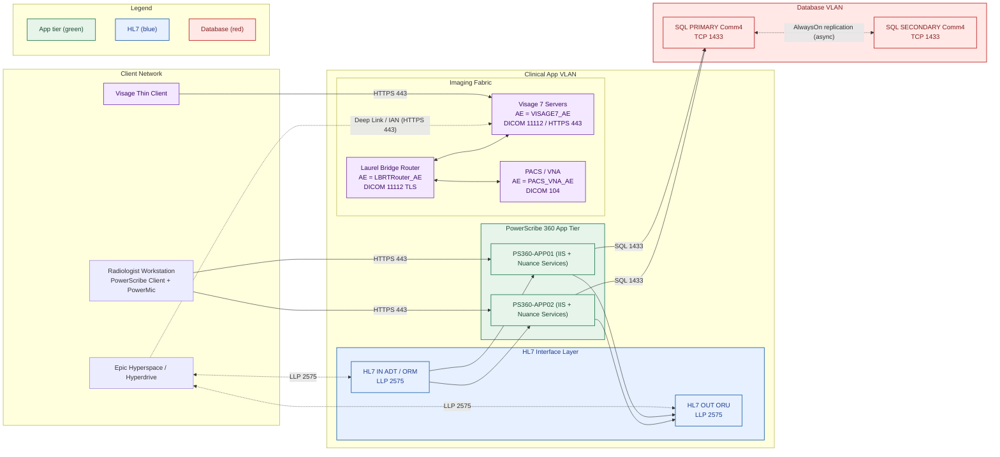
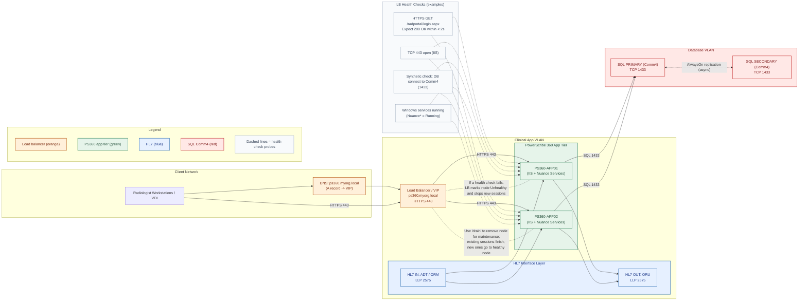

# Standing-Up-PS360
#A one-pager architecture plan and maintenance change plan; an Implementation plan + change ticket for standing up PS360

## Overview
This diagram shows a reference deployment for **PowerScribe 360 (PS360)** integrated with **Visage 7**, Epic, an HL7 interface layer, and a DICOM router. It models redundant PS360 app servers, SQL AlwaysOn for the Comm4 database, HL7 ADT/ORM/ORU flows, DICOM routing to Visage/PACS, and Epic deep-link/Image Availability Notification (IAN).

## Scope & Assumptions
- Vendor apps are “vended systems”; IT configures, integrates, and operates (no source-code changes).
- PS360 app tier is two-node for resiliency; SQL AG is async (one primary, one secondary).
- Epic launches Visage with context; IAN is used to light up “images available” quickly.
- Router dual-sends PE-protocol CT to AI/Visage (optional) and all CT/MR to PACS/VNA.

## Component Glossary
- **PS360-APP01/02** – IIS + Nuance services (dictation, templates, reporting).
- **Comm4 (SQL AG)** – PowerScribe database (AlwaysOn).  
- **HL7 Interface Layer** – LLP 2575 channels: ADT/ORM in, ORU out to Epic.
- **Laurel Bridge Router** – DICOM/DICOMweb routing; may emit IAN.
- **Visage 7** – Server-side rendering; thin client launch from Epic.
- **PACS/VNA** – Long-term storage and enterprise distribution.

## Data Flow (high level)
1. **Order**: Epic → HL7 ORM; **ADT** for patient/visit.
2. **Acquisition**: Modality → Router → Visage/PACS; router optionally sends IAN to Epic.
3. **Read**: Radiologist views in Visage; dictates/finalizes in PS360.
4. **Report**: PS360 → HL7 ORU → Epic (and archive).  
5. **(Optional AI/SR)**: Router → AI service → DICOM SR/keys → Visage; mapped into PS360 templates.

## Ports, AEs, and Zones
| Layer | Purpose | Protocol/Port | Example IDs |
|---|---|---:|---|
| Client↔PS360 | App access | HTTPS **443** | — |
| HL7 IN (ADT/ORM) | Orders/demographics | LLP **2575** | Channel: `RAD_ADT_IN`, `RAD_ORM_IN` |
| HL7 OUT (ORU) | Final report to Epic | LLP **2575** | Channel: `RAD_ORU_OUT` |
| PS360↔SQL | Comm4 DB | SQL **1433** | Instance: `SQLCLUST01\PS360` |
| DICOM Router | Store/Move | DICOM **104/11112** | AE: `LBRTRouter_AE` |
| Visage | Viewer / DICOM | HTTPS **443** / **11112** | AE: `VISAGE7_AE` |
| PACS/VNA | Archive | DICOM **104** | AE: `PACS_VNA_AE` |

> **Zones:** Client Network (workstations), Clinical App VLAN (PS360/HL7/Router/Visage), Database VLAN (SQL AG). Restrict inter-zone traffic to required ports only; terminate TLS per policy.

## Change & Rollback (summary)
- **Pre-flight:** Full Comm4 backup, app snapshots, confirm client/server version compatibility.
- **Order of ops:** Stop PS360 services → DB upgrade (if required) → app upgrade APP01→APP02 → start services.
- **Smoke test:** Admin portal login; test dictation; sign report; verify ORU in Epic; verify Visage launch/latency.
- **Rollback:** Stop services → restore Comm4 backup → revert VM snapshot → keep clients on prior version.

## Validation Checklist
- ADT/ORM arrive and populate worklists; ORU ACKs clean (AA).
- Visage time-to-first-image within target (e.g., <2–3s on LAN).
- Router dual-send rules work (no loops); IAN fires within 30s.
- PS templates/macros load; microphones recognized (PowerMic/VDI).

## Notes for Reviewers
- This is a reference blueprint; replace AE titles, ports, and channel names with site-specific values.

